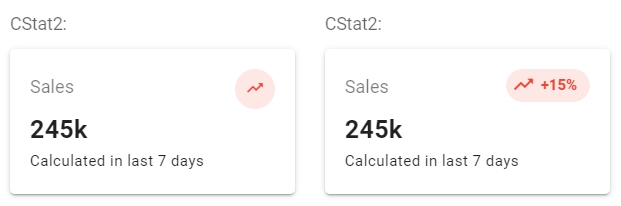
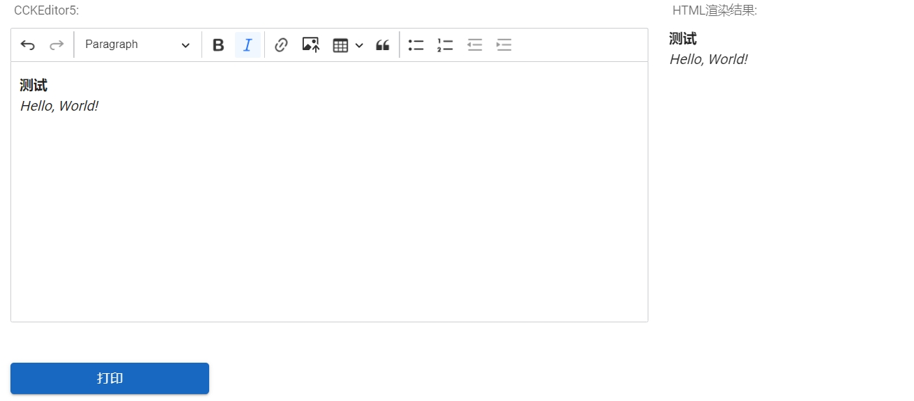

# Vuetify3 Plus

顾名思义，Vuetify3 Plus，不是一套全新的UI框架，而是对Vuetify 3的补充和加强。

在我们把Vuetify从v2升级到v3的时候，Vuetify的最新版本是3.3.x，此时的组件库还不够完备，`VDataTable`、`VDatePicker`等尚在Labs积极开发中，`VTimePicker`、`VTreeView`等还不见踪影，而上述组件对To B应用来说是不可或缺的，加上部分组件不匹配我们的使用习惯，为了：

* 进一步扩大组件库；
* 补位尚在规划、开发中的组件；
* 提升组件的可用性、易用性；

我们只好自己动手寻找合适的替代品、扩展现有的组件库，最终的成果就是——Vuetify3 Plus，后期基于Vuetify 3.4.0+，部分组价（或灵感）来自于Element Plus和Quasar。

组件名称前缀——“C”，可以解释成“Core”、“Common”；

## 使用指南
### 表格
### 交互（3）

#### 消息框（CMessage）

```
import {CMessage} from 'vuetify3-plus';

CMessage.success('Hello, World');
CMessage.info('Hello, World');
CMessage.warning('Hello, World');
CMessage.error('Hello, World');
```

* 属性

    * 无；

* 事件

    * 无；

* 插槽

    * 无；

* 方法

  | 名称      | 描述                  | 参数       | 返回值 |
    | --------- | --------------------- | ---------- | ------ |
  | `success` | 显示`success`类型消息 | `[string]` | 无     |
  | `info`    | 显示`info`类型消息    | `[string]` | 无     |
  | `warning` | 显示`warning`类型消息 | `[string]` | 无     |
  | `error`   | 显示`error`类型消息   | `[string]` | 无     |

#### 弹出框（CModal）

用于替代`window.alert`、`window.confirm`和`window.prompt`。

```
import {CModal} from 'vuetify3-plus';

CModal.alert({
    title: 'Alert',
    message: 'Hello, World',
});

CModal.confirm({
    title: 'Confirm',
    message: 'Are you OK?',
    onOkClick() {
    	CMessage.success('Yes');
    },
    onCancelClick() {
    	CMessage.error('No');
    },
});

CModal.prompt({
    title: 'Prompt',
    message: 'Please input numbers:',
    onOkClick(input) {
    	CMessage.success(`Numbers are ${input}`);
    },
    onCancelClick() {
    	CMessage.error('Cancel');
    },
});
```

* 属性

    * 无；

* 事件

    * 无；

* 插槽

    * 无；

* 方法

  | 名称      | 描述                             | 参数          | 返回值 |
    | --------- |-------------| ---------- | ------ |
  | `alert`   | 显示警告弹窗，并等待用户关闭     | `[object]`  | 无     |
  | `confirm` | 显示确认弹窗，并等待用户确定     | `[object]`  | 无     |
  | `prompt`  | 显示输入弹窗，并返回用户输入结果 | `[object]`  | 无     |

  参数说明：

  ```
  {
      title: 标题,
      message: 消息,
      onOkClick: 回调函数，当用户点击确定按钮时触发,
      onCancelClick: 回调函数，当用户点击取消按钮时触发,
  }
  ```

#### 加载（CLoading）

```
import {CLoading} from 'vuetify3-plus';

CLoading.open();
CLoading.close();
```

* 属性

    * 无；

* 事件

    * 无；

* 插槽

    * 无；

* 方法

  | 名称    | 描述     | 参数 | 返回值 |
    | ------- | -------- | ---- | ------ |
  | `open`  | 显示加载 | 无   | 无     |
  | `close` | 关闭加载 | 无   | 无     |

### 表单（10）

#### 密码（CPassword）

```
<CPassword
    v-model="password"
    variant="outlined"
    density="compact"
    clearable>
</CPassword>
```
效果图：


* 属性
    * 同`VTextField`；
* 事件
    * 同`VTextField`；
* 插槽
    * 无；
* 方法
    * 无；

#### 验证码（CCaptcha）
```
<CCaptcha
    v-model="captcha"
    url="/demos/captcha.jpg"
    variant="outlined"
    density="compact"
    clearable>
</CCaptcha>
```
效果图：


* 属性

    * 同`VTextField`；

    * | 名称  | 描述           | 类型     | 默认值 |
            | ----- | -------------- | -------- | ------ |
      | `url` | 验证码图片地址 | `string` | `null` |

* 事件
    * 同`VTextField`；

* 插槽
    * 无；

* 方法
    * 无；

#### 邮件（CEmail）
邮件地址输入自动补全。
```
<CEmail
    v-model="email"
    variant="outlined"
    density="compact"
    clearable>
</CEmail>
```
效果图：


* 属性

    * 同`VTextField`；

    * | 名称      | 描述       | 类型    | 默认值                                                       |
              | --------- | ---------- | ------- | ------------------------------------------------------------ |
      | `servers` | 邮件服务器 | `array` | `['gmail.com', 'qq.com', '163.com', 'vip.163.com', '126.com', 'vip.126.com', 'outlook.com', 'hotmail.com', 'foxmail.com', '139.com', '188.com']` |

* 事件
    * 同`VTextField`；

* 插槽
    * 无；

* 方法
    * 无；

#### 日期选择（CDatePicker）
```
<CDatePicker
    v-model="date"
    label="日期"
    variant="outlined"
    density="compact"
    clearable>
</CDatePicker>
```
效果图：


* 属性
    * 同`VTextField`；
* 事件
    * 同`VTextField`；
* 插槽
    * 无；
* 方法
    * 无；

#### 日期时间选择（CDatetimePicker）
```
<CDatetimePicker
    v-model="time"
    pick-second
    label="日期时间"
    variant="outlined"
    density="compact"
    clearable>
</CDatetimePicker>
```
效果图：


* 属性

    * 同`VTextField`；

    * | 名称         | 描述                                                     | 类型      | 默认值       |
            | ------------ | -------------------------------------------------------- | --------- | ------------ |
      | `pickSecond` | 是否允许选择秒                                           | `boolean` | `false`      |
      | `dateFormat` | 日期格式                                                 | `string`  | `yyyy-MM-dd` |
      | `timeFormat` | 时间格式，值可由用户自定义，或者根据`pickSecond`的值变化 | `string`  | `HH:mm`      |

* 事件
    * 同`VTextField`；

* 插槽
    * 无；

* 方法
    * 无；

#### 级联选择（CCascader）
```
<CCascader
    v-model="productId1"
    label="商品"
    url="/demos/products1.json"
    variant="outlined"
    density="compact"
    multiple
    clearable>
</CCascader>
```
效果图：


* 属性

    * 同`VTextField`；

    * | 名称           | 描述                                                    | 类型      | 默认值     |
            | -------------- | ------------------------------------------------------- | --------- | ---------- |
      | `items`        | 数据集                                                  | `array`   | `[]`       |
      | `url`          | 数据集API地址，若`items`的值不为空，则以`items`的值为主 | `string`  | `null`     |
      | `itemId`       | 数据项的值对应属性                                      | `string`  | `id`       |
      | `itemTitle`    | 数据项名称对应属性                                      | `string`  | `title`    |
      | `itemChildren` | 数据项子集对应属性                                      | `string`  | `children` |
      | `multiple`     | 是否允许多选                                            | `boolean` | `false`    |

* 事件
    * 同`VTextField`；

* 插槽
    * 无；

* 方法
    * 无；

#### 下拉选择（CSelect）

> 选择类的组件，如VSelect、VAutocomplete等，鉴于它们的属性、数据结构类似，并且，对它们有部分相同的扩展需求——比如通过URL加载数据，返回选中项的名称等，因此，创建了一个无渲染组件——BaseSelect来达到上述目的。

```
<CSelect
    v-model="productId2"
    v-model:title="productTitle2"
    label="商品"
    url="/demos/products2.json"
    variant="outlined"
    density="compact"
    clearable>
</CSelect>
```

* 属性

    * 同`VSelect`；

    * | 名称        | 描述                                                    | 类型     | 默认值  |
            | ----------- | ------------------------------------------------------- | -------- | ------- |
      | `items`     | 数据集                                                  | `array`  | `[]`    |
      | `url`       | 数据集API地址，若`items`的值不为空，则以`items`的值为主 | `string` | `null`  |
      | `itemValue` | 数据项的值对应属性                                      | `string` | `value` |
      | `itemTitle` | 数据项名称对应属性                                      | `string` | `title` |

* 事件

    * 同`VSelect`；

* 插槽

    * 无；

* 方法

    * 无；

#### 自动补全（CAutocomplete）

```
<CAutocomplete
    v-model="productId2"
    v-model:title="productTitle2"
    label="商品"
    url="/demos/products2.json"
    variant="outlined"
    density="compact"
    clearable>
</CAutocomplete>
```

* 属性
    * 同`VAutocomplete`和`CSelect`；
* 事件
    * 同`VAutocomplete`；
* 插槽
    * 无；
* 方法
    * 无；

#### 纸片组（CChipGroup）

```
<CChipGroup
    v-model="productId2"
    url="/demos/products2.json"
    selected-class="text-warning"
    column
    chip-size="small"
    chip-variant="outlined"
    chip-filter>
</CAutocomplete>
```

效果图：


* 属性
    * 同`VChipGroup`和`CSelect`；
    * 前缀是`chip-`的属性同`VChip`；
* 事件
    * 同`VChipGroup`；
* 插槽
    * 无；
* 方法
    * 无；

#### 上传文件（CFileUpload）

与`VFileInput`仅是一个输入框不同，`CFileUpload`能够识别文件类型，若文件是图片，则允许预览，否则支持下载。

```
<CFileUpload
    v-model="fileId"
    label="上传文件"
    upload-file-url="/api/file-explorer/files/upload"
    browse-file-url="/api/file-explorer/files/download"
    variant="outlined"
    density="compact"
    clearable>
</CFileUpload>
```

效果图：


* 属性

    * 同`VFileInput`；

    * | 名称            | 描述                                                         | 类型     | 默认值 |
            | --------------- | ------------------------------------------------------------ | -------- | ------ |
      | `uploadFileUrl` | 文件上传地址，该API需要接收参数`upload`，返回文件信息，文件信息包含名称、缩略图、类型等。文件类型同MIME。 | `string` | `null` |
      | `browseFileUrl` | 文件预览、下载地址，该API需要接收参数`id`（文件ID），并且支持`HEAD`方法，响应头中包含文件信息`file-info`。 | `string` | `null` |

* 事件

    * 同`VFileInput`；

* 插槽

    * 无；

* 方法

    * 无；

### 图表

### 统计（7）

#### v1（CStat1）

```
<CStat1
    color="red"
    title="245k"
    subtitle="Sales"
    text="Calculated in last 7 days"
    variant="text">
</CStat1>
```

效果图：


* 属性

    * | 名称       | 描述   | 类型     | 默认值 |
          | ---------- | ------ | -------- | ------ |
      | `title`    | 标题   | `string` | `null` |
      | `subtitle` | 副标题 | `string` | `null` |
      | `text`     | 文本   | `string` | `null` |

* 事件

    * 无；

* 插槽

    * | 名称       | 描述   | 作用域 |
          | ---------- | ------ | ------ |
      | `title`    | 标题   | 无     |
      | `subtitle` | 副标题 | 无     |
      | `text`     | 文本   | 无     |

* 方法

    * 无；

#### v2（CStat2）

```
<CStat2
    title="245k"
    subtitle="Sales"
    icon="mdi-trending-up"
    color="red"
    text="Calculated in last 7 days">
</CStat2>
```

效果图：



* 属性

    * | 名称       | 描述         | 类型     | 默认值 |
          | ---------- | ------------ | -------- | ------ |
      | `title`    | 标题         | `string` | `null` |
      | `subtitle` | 副标题       | `string` | `null` |
      | `text`     | 文本         | `string` | `null` |
      | `icon`     | 图标         | `string` | `null` |
      | `color`    | 颜色（图标） | `string` | `null` |

* 事件

    * 无；

* 插槽

    * | 名称    | 描述 | 作用域 |
          | ------- | ---- | ------ |
      | `title` | 标题 | 无     |
      | `icon`  | 图标 | 无     |
      | `text`  | 文本 | 无     |

* 方法

    * 无；

#### v3（CStat3）

```
<CStat3
    title="245k"
    subtitle="Sales"
    color="red"
    expected="999"
    actual="245">
</CStat3>
```

效果图：


* 属性

    * | 名称       | 描述           | 类型               | 默认值 |
          | ---------- | -------------- | ------------------ | ------ |
      | `title`    | 标题           | `string`           | `null` |
      | `subtitle` | 副标题         | `string`           | `null` |
      | `color`    | 颜色（进度条） | `string`           | `null` |
      | `actual`   | 实际值         | `string`、`number` | `null` |
      | `expected` | 预期值         | `string`、`number` | `null` |

* 事件

    * 无；

* 插槽

    * | 名称       | 描述   | 作用域 |
          | ---------- | ------ | ------ |
      | `title`    | 标题   | 无     |
      | `subtitle` | 副标题 | 无     |

* 方法

    * 无；

#### v4（CStat4）

```
<CStat4
    title="245k"
    subtitle="Sales"
    text="Calculated in last 7 days"
    emphasis="+15%"
    color="red">
</CStat4>
```

效果图：


* 属性

    * | 名称       | 描述               | 类型     | 默认值 |
          | ---------- | ------------------ | -------- | ------ |
      | `title`    | 标题               | `string` | `null` |
      | `subtitle` | 副标题             | `string` | `null` |
      | `text`     | 文本               | `string` | `null` |
      | `emphasis` | 强调               | `string` | `null` |
      | `color`    | 颜色（标记、强调） | `string` | `null` |

* 事件

    * 无；

* 插槽

    * | 名称       | 描述   | 作用域 |
          | ---------- | ------ | ------ |
      | `title`    | 标题   | 无     |
      | `subtitle` | 副标题 | 无     |
      | `text`     | 文本   | 无     |
      | `emphasis` | 强调   | 无     |

* 方法

    * 无；

#### v5（CStat5）

```
<CStat5
    title="245k"
    subtitle="Sales"
    text="Calculated in last 7 days"
    icon="mdi-trending-up"
    color="red">
</CStat5>
```

效果图：


* 属性

    * | 名称       | 描述         | 类型     | 默认值 |
          | ---------- | ------------ | -------- | ------ |
      | `title`    | 标题         | `string` | `null` |
      | `subtitle` | 副标题       | `string` | `null` |
      | `text`     | 文本         | `string` | `null` |
      | `icon`     | 图标         | `string` | `null` |
      | `color`    | 颜色（图标） | `string` | `null` |

* 事件

    * 无；

* 插槽

    * 暂无；

* 方法

    * 无；

#### v6（CStat6）

```
<CStat6
    title="245k"
    subtitle="Sales"
    icon="mdi-trending-up"
    color="red">
</CStat6>
```

效果图：


* 属性

    * | 名称       | 描述                                                         | 类型      | 默认值     |
          | ---------- | ------------------------------------------------------------ | --------- | ---------- |
      | `title`    | 标题                                                         | `string`  | `null`     |
      | `subtitle` | 副标题                                                       | `string`  | `null`     |
      | `icon`     | 图标                                                         | `string`  | `null`     |
      | `color`    | 颜色（图标）                                                 | `string`  | `null`     |
      | `rounded`  | 形状是否是圆角矩形，默认圆形                                 | `boolean` | `true`     |
      | `variant`  | 变体，可选值有`flat`、`text`、`elevated`、`tonal`、`outlined`、`plain`等 | `string`  | `elevated` |

* 事件

    * 无；

* 插槽

    * | 名称       | 描述   | 作用域 |
          | ---------- | ------ | ------ |
      | `title`    | 标题   | 无     |
      | `subtitle` | 副标题 | 无     |
      | `icon`     | 图标   | 无     |

* 方法

    * 无；

#### v7（CStat7）

```
<CStat7
    title="Google Drive"
    subtitle="Automate your file upload workflow"
    icon="mdi-google-drive"
    avatar
    color="grey"
    btn-text="Connected"
    btn-color="red">
</CStat7>
```

效果图：


* 属性

    * | 名称       | 描述               | 类型      | 默认值  |
          | ---------- | ------------------ | --------- | ------- |
      | `title`    | 标题               | `string`  | `null`  |
      | `subtitle` | 副标题             | `string`  | `null`  |
      | `avatar`   | 是否显示头像       | `boolean` | `false` |
      | `icon`     | 图标               | `string`  | `null`  |
      | `color`    | 颜色（头像、图标） | `string`  | `null`  |
      | `btnText`  | 按钮文本           | `string`  | `null`  |
      | `btnColor` | 按钮颜色           | `string`  | `null`  |

* 事件

    * 无；

* 插槽

    * 暂无；

* 方法

    * 无；

### 其他（5）

#### 图片（CImg）

结合`VImg`和`v-viewer`，支持放大缩小、旋转、翻转图片等。

```
<CImg src="/demos/bear.jpg"></CImg>
```

效果图：


* 属性
    * 同`VImg`；
* 事件
    * 同`VImg`；
* 插槽
    * 无；
* 方法
    * 无；

#### 链接（CAnchor）

```
<CAnchor
    text="百度"
    href="https://www.baidu.com/"
    hint="百度一下，你就知道"
    show-hint>
</CAnchor>
```

* 属性

    * | 名称       | 描述         | 类型      | 默认值  |
          | ---------- | ------------ | --------- | ------- |
      | `text`     | 名称         | `string`  | `null`  |
      | `href`     | 链接         | `string`  | `null`  |
      | `disabled` | 是否禁用     | `boolean` | `false` |
      | `showHint` | 是否显示提示 | `boolean` | `false` |
      | `hint`     | 提示         | `string`  | `null`  |

* 事件

    * 无；

* 插槽

    * 无；

* 方法

    * 无；

#### 标签（CLabel）

```
<CLabel
    :value="21"
    url="/demos/products2.json">
</CLabel>
```

* 属性

    * | 名称        | 描述                                                    | 类型     | 默认值  |
          | ----------- | ------------------------------------------------------- | -------- | ------- |
      | `value`     | 值                                                      | `any`    | `null`  |
      | `items`     | 数据集                                                  | `array`  | `[]`    |
      | `url`       | 数据集API地址，若`items`的值不为空，则以`items`的值为主 | `string` | `null`  |
      | `itemTitle` | 数据项的值对应属性                                      | `string` | `title` |
      | `itemValue` | 数据项名称对应属性                                      | `string` | `value` |

* 事件

    * 无；

* 插槽

    * 无；

* 方法

    * 无；

#### 旋转器（CSpinner）

参考Quasar框架实现。

```
<CSpinner 
    class="ml-2" 
    size="2em" 
    :thickness="2">
 </CSpinner>
```

效果图：


* 属性

    * | 名称        | 描述     | 类型               | 默认值    |
          | ----------- | -------- | ------------------ | --------- |
      | `color`     | 颜色     | `string`           | `primary` |
      | `size`      | 尺寸大小 | `string`、`number` | `1em`     |
      | `thickness` | 粗细程度 | `number`           | `5`       |

* 事件

    * 无；

* 插槽

    * 无；

* 方法

    * 无；

#### 富文本编辑器（CCKEditor5）

```
<CCKEditor5
    ref="ckeditor"
    v-model="html"
    upload-file-url="/api/file-explorer/files/upload"
    browse-file-url="/api/file-explorer/files/download">
</CCKEditor5>
```

效果图：



* 属性

    * | 名称            | 描述                                                         | 类型     | 默认值      |
          | --------------- | ------------------------------------------------------------ | -------- | ----------- |
      | `modelValue`    | 值                                                           | `string` | `null`      |
      | `adapter`       | 文件上传适配器，可选的值有`simple`，`ckeditor5`。若值为`simple`时，则使用CKEditor 5内置的`SimpleUploadAdapter`。 | `string` | `ckeditor5` |
      | `uploadFileUrl` | 文件上传地址，当`adapter`的值为`ckeditor5`时，该API需要接收参数`upload`，返回文件信息。 | `string` | `null`      |
      | `browseFileUrl` | 文件预览、下载地址，当`adapter`的值为`ckeditor5`时，该API需要接收参数`id`（文件ID）。 | `string` | `null`      |

* 事件

    * 无；

* 插槽

    * 无；

* 方法

    * | 名称      | 描述                           | 参数 | 返回值   |
          | --------- | ------------------------------ | ---- | -------- |
      | `getHtml` | 获取HTML，同属性`modelValue`。 | 无   | `string` |
      | `getText` | 获取纯文本。                   | 无   | `string` |

    